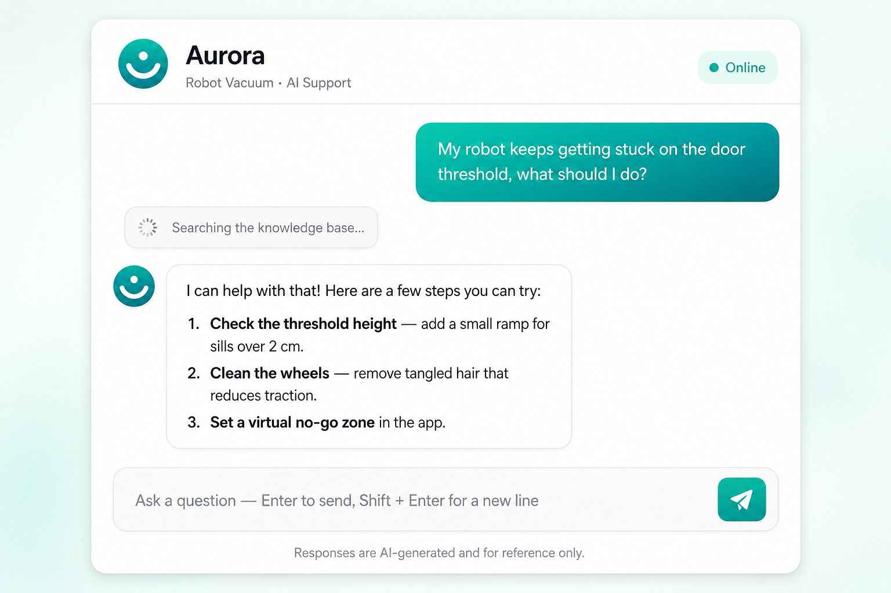

# Aurora · Robot Vacuum AI Support

> An AI customer-support assistant for robot vacuums, built on a LangChain / LangGraph ReAct Agent with RAG. FastAPI backend, vanilla HTML/JS frontend, with token-level streaming, multi-turn memory, and incremental knowledge-base updates.

> **Works with any OpenAI-compatible endpoint** — OpenAI, Azure OpenAI, or local models (Ollama, vLLM, LM Studio). Defaults to `gpt-4o-mini` + `text-embedding-3-small`; point `OPENAI_BASE_URL` at any compatible provider to switch.

---

## Demo

<!--
  Add a screenshot and a short screen recording, then uncomment the lines below.
  - docs/screenshot.png : a still of the chat UI mid-answer
  - docs/demo.gif       : ~10s clip showing a question -> streamed answer -> a tool call



-->

_Screenshot / GIF coming soon — run it locally in under a minute with the Quick Start below._

---

## Overview

**Aurora** is an AI customer-support app for robot vacuum / vacuum-and-mop users. Users ask questions in the web UI, and a ReAct (Reasoning + Acting) Agent autonomously plans and calls tools (knowledge-base retrieval, weather, geolocation, usage reports, etc.), grounds its answer in retrieved knowledge, and streams the reply back token by token.

Key features:

- **RAG retrieval augmentation** — Product guides, FAQs, troubleshooting and maintenance docs are vectorized. Retrieval filters by relevance score to avoid stuffing irrelevant material into the prompt, with optional reranking.
- **ReAct multi-tool calling** — The agent reasons and calls tools over multiple rounds until the user's need is met.
- **Conversational memory** — Multi-turn memory via a LangGraph checkpointer, persisted to SQLite. Long conversations are automatically summarized to keep context and token cost under control.
- **Token-level streaming** — Answers are pushed token by token over SSE; the frontend renders incrementally with safe Markdown formatting.
- **Dynamic prompting** — Middleware detects "generate usage report" intent and switches the system prompt on the fly.
- **Production basics** — Optional API-key auth, per-client rate limiting, CORS, per-request logging, and model-call timeout/retry.

---

## Tech Stack

| Layer | Choice |
|---|---|
| Web framework | FastAPI + Uvicorn (SSE streaming) |
| Frontend | Vanilla HTML / CSS / JavaScript (no framework) |
| Agent | LangChain `create_agent` (ReAct) + LangGraph |
| LLM | Any OpenAI-compatible chat model (default `gpt-4o-mini`) via `langchain-openai` |
| Embedding | Any OpenAI-compatible embedding model (default `text-embedding-3-small`) |
| Vector store | Chroma (local persistence) |
| Memory store | LangGraph SqliteSaver (`checkpoints.sqlite`) |
| External services | OpenWeatherMap (weather) · ip-api.com (IP geolocation, no key) |

---

## Architecture

```
                     Browser (web/ vanilla frontend)
                     EventSource ── SSE streaming
                              │
              ┌───────────────▼────────────────┐
              │        FastAPI (app.py)         │
              │  auth · rate limit · CORS · logs│
              │  GET /api/chat  (SSE token flow)│
              └───────────────┬────────────────┘
                              │
              ┌───────────────▼────────────────┐
              │   ReactAgent (agent/react_agent)│
              │  Middleware:                    │
              │   · Summarization (memory)      │
              │   · ModelCallLimit (loop cap)   │
              │   · monitor_tool / logs / prompt│
              │  Memory: SqliteSaver (thread_id)│
              └──┬───────────┬────────────┬─────┘
                 │           │            │
                 ▼           ▼            ▼
        ┌──────────────┐ ┌─────────┐ ┌──────────────┐
        │  RAG service │ │ Weather │ │ usage records │
        │  rag/        │ │  + geo  │ │ data/external │
        └──────┬───────┘ └─────────┘ └──────────────┘
               ▼
        ┌──────────────────────────┐
        │ Chroma store (chroma_db/) │
        │ score filter + rerank     │
        └──────────────────────────┘
```

---

## Project Structure

```
Aurora/
├── app.py                     # FastAPI entrypoint (SSE / auth / rate limit / static)
├── web/                       # Vanilla frontend
│   ├── index.html
│   ├── styles.css
│   └── app.js
├── agent/
│   ├── react_agent.py         # ReAct agent, memory, streaming events
│   └── tools/
│       ├── agent_tools.py     # Tool definitions
│       └── middleware.py      # Custom middleware
├── rag/
│   ├── rag_service.py         # Retrieval + score filtering + optional rerank
│   └── vector_store.py        # Chroma management + incremental KB updates
├── model/
│   └── factory.py             # LLM / Embedding factory (timeout, retries)
├── utils/
│   ├── config_handler.py      # YAML loading + .env + ${VAR} resolution
│   ├── settings.py            # Runtime settings (auth / rate limit / memory)
│   ├── logger_handler.py      # Logging
│   ├── prompt_loader.py       # Prompt loading
│   ├── file_handler.py        # Document loading & MD5
│   └── path_tool.py           # Path helpers
├── config/
│   ├── rag.yml                # Model names / access (references .env placeholders)
│   ├── chroma.yml             # Vector store & retrieval params
│   ├── agent.yml              # External service config (weather / geolocation)
│   └── prompts.yml            # Prompt file paths
├── prompts/                   # Prompt texts
├── data/                      # KB documents (txt/pdf) + external/records.csv
├── tests/                     # Unit tests
├── Dockerfile / .dockerignore
├── .env.example               # Env var template (copy to .env)
├── requirements.txt
└── README.md
```

> Generated at runtime and git-ignored: `.env`, `chroma_db/`, `checkpoints.sqlite*`, `md5.text`, `logs/`.

---

## Quick Start

### 1. Requirements

- Python 3.10+ (uses syntax such as `tuple[...]` and `str | None`)

### 2. Install dependencies

```bash
python -m pip install -r requirements.txt
```

### 3. Configure secrets

Copy the template and fill in real values (`.env` is not committed to git):

```bash
cp .env.example .env
```

Minimum required in `.env`:

```dotenv
OPENAI_API_KEY=sk-your-openai-api-key
# Optional — only if you want the live weather tool
OPENWEATHER_API_KEY=your-openweathermap-key
```

To use a provider other than OpenAI, set the endpoint and model names:

```dotenv
# Example: Azure OpenAI, a local model, or any OpenAI-compatible gateway
OPENAI_BASE_URL=http://localhost:11434/v1
LLM_MODEL=llama3.1
EMBEDDING_MODEL=nomic-embed-text
# Some endpoints cap embedding batch size:
# EMBEDDING_BATCH_SIZE=10
```

- OpenAI API keys: <https://platform.openai.com/api-keys>
- OpenWeatherMap (free tier): <https://openweathermap.org/api>

### 4. Build the knowledge base

Sample English docs are included under `data/`. Add your own `.txt` / `.pdf` files there, then ingest (required on first run):

```bash
python -m rag.vector_store
```

### 5. Run the server

```bash
python app.py
# or
python -m uvicorn app:app --host 127.0.0.1 --port 8000
```

Open <http://127.0.0.1:8000> to start chatting.

---

## Configuration

### Environment variables (`.env`)

| Variable | Default | Description |
|---|---|---|
| `OPENAI_API_KEY` | — (required) | API key for the LLM / embedding provider |
| `OPENAI_BASE_URL` | `https://api.openai.com/v1` | Any OpenAI-compatible endpoint |
| `LLM_MODEL` | `gpt-4o-mini` | Chat model name |
| `EMBEDDING_MODEL` | `text-embedding-3-small` | Embedding model name |
| `EMBEDDING_BATCH_SIZE` | `10` | Texts per embedding request (raise for OpenAI to speed up) |
| `OPENWEATHER_API_KEY` | empty | OpenWeatherMap key; empty disables the weather tool |
| `LLM_TIMEOUT` | `60` | Per model-call timeout (seconds) |
| `LLM_MAX_RETRIES` | `2` | Model-call retry count |
| `APP_API_KEY` | empty | When set, `/api/*` requires `?key=...`; empty disables auth |
| `RATE_LIMIT_PER_MIN` | `20` | Per-client (IP + session) requests per minute |
| `ALLOWED_ORIGINS` | `*` | CORS allowed origins, comma-separated |
| `MEMORY_DB_PATH` | `checkpoints.sqlite` | Memory persistence file |
| `SESSION_TTL_MINUTES` | `180` | Idle time before a session's memory is cleared (≤0 = never) |
| `SUMMARY_TRIGGER_MESSAGES` | `30` | Summarize history once it exceeds this many messages |
| `SUMMARY_KEEP_MESSAGES` | `12` | Recent messages to keep after summarization |
| `MODEL_RUN_LIMIT` | `12` | Max model-call rounds within a single conversation |

> Secrets live only in `.env`; `config/*.yml` reference them via `${VAR}` / `${VAR:-default}` — no plaintext keys in config.

### Vector store & retrieval (`config/chroma.yml`)

```yaml
k: 3                    # snippets finally passed to the model
candidate_k: 20         # initial candidate pool size
score_threshold: 0.3    # relevance threshold; below this is treated as irrelevant and dropped
rerank_enabled: false   # enable reranking (requires a rerank-capable endpoint)
chunk_size: 400         # text chunk size (requires re-ingest to apply)
chunk_overlap: 50
```

> After changing chunking params, rebuild the store to apply them to existing data: delete `chroma_db/` and `md5.text`, then run `python -m rag.vector_store`.

---

## API

| Method | Path | Description |
|---|---|---|
| GET | `/` | Frontend page |
| GET | `/api/chat` | SSE streaming chat. Params: `message` (required), `session` (session ID; keeps memory within a session), `key` (auth, if enabled) |
| POST | `/api/admin/reload` | Reload the knowledge base in the background (auth required) |
| GET | `/api/health` | Health check |

**SSE event format** (`data:` carries JSON):

| `type` | Fields | Meaning |
|---|---|---|
| `token` | `mid`, `content` | Answer text delta (grouped by message id) |
| `tool` | `mid`, `name`, `label` | Tool-call status hint |
| `error` | `content` | Error message |
| `done` | — | End of the turn |

---

## Conversational Memory

- Each conversation is keyed by `session` (`thread_id`); memory is persisted to `checkpoints.sqlite` via the LangGraph SqliteSaver.
- The frontend generates a new `session` on every **page refresh**, so refreshing starts a brand-new conversation (old memory remains in the store and is cleaned up by TTL).
- When history exceeds the threshold, `SummarizationMiddleware` summarizes older messages and keeps only the most recent ones, bounding context length and cost.
- `SESSION_TTL_MINUTES` controls cleanup of idle sessions' memory.

> For multi-process / multi-worker deployments, SQLite's concurrency is limited — use a Redis / Postgres checkpointer instead.

---

## Tools

| Tool | Description |
|---|---|
| `rag_summarize` | Retrieve relevant material from the vector knowledge base |
| `get_weather` | Get real-time weather for a city (OpenWeatherMap) |
| `get_user_location` | Resolve the user's city via IP (ip-api.com) |
| `get_user_id` | Get the current user ID |
| `get_current_month` | Get the current month |
| `fetch_external_data` | Fetch a user's usage records for a given month |
| `fill_context_for_report` | Trigger report mode (middleware switches to the report prompt) |

---

## Knowledge Base Management

- Supports `.txt` / `.pdf`; place files in `data/` and run `python -m rag.vector_store` to ingest.
- **Incremental, self-cleaning updates**: tracked by "source file + MD5". Unchanged files are skipped; when a file changes, its old vectors are deleted by source before the new content is written, preventing stale/duplicate data.
- You can also trigger a background reload at runtime via `POST /api/admin/reload`.

---

## Testing

```bash
python -m pytest -q
```

Covers pure logic (no network): file-suffix filtering, MD5 computation, `.env` variable resolution, etc.

---

## Deployment (Docker)

```bash
docker build -t aurora .
docker run -d -p 8000:8000 --env-file .env --name aurora aurora
```

The image includes a health check and runs a single worker by default (paired with SQLite memory). For multiple replicas in production, switch to an external memory store.

---

## Logging

- Stored under `logs/`, one file per day (`agent_YYYYMMDD.log`).
- Console outputs INFO+, file outputs DEBUG+.
- Every `/api` request carries a `request_id` and logs method, path, status code, and latency.

---

## Roadmap

- Migrate memory to Redis / Postgres for multi-replica deployment
- Hybrid retrieval (BM25 + vector) and query rewriting
- Frontend "new chat", message retry, and stop-generation
- Stronger auth (sessions / signatures) and auditing

---

## License

Released under the MIT License. See [LICENSE](LICENSE) for details. For learning and reference purposes.
